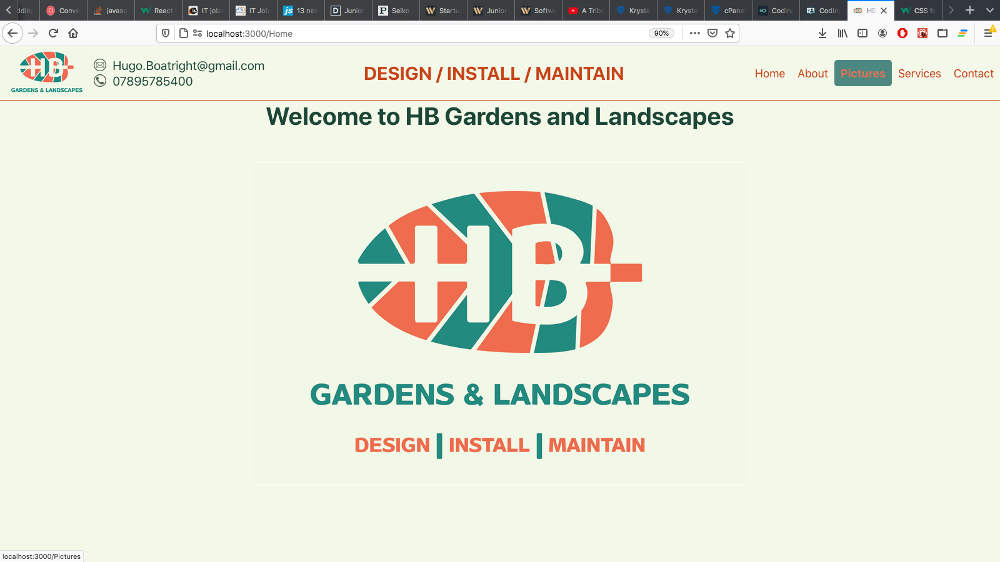
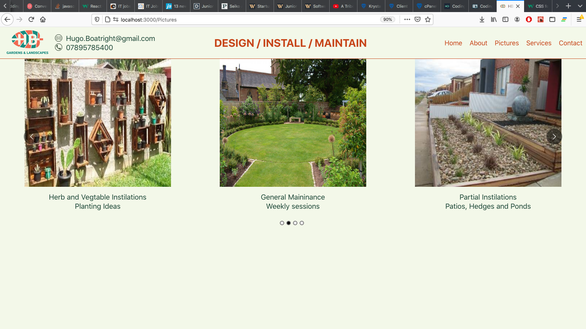
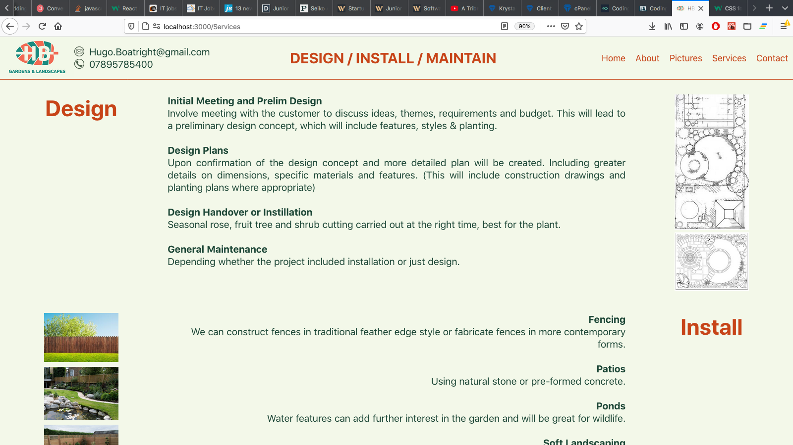

# Project Outline 
Simple website for Hugo Boatright Gardening and Landscapes.
The project was to build a simple React web page to both allow clients to contact HGgardens and showcase HBgardening's previous projects and work.
The tech stack was built on a React (cra) base with several packages to help with different actions and animations. I used this project to test several variations on the same package to find the most useful and see the differences on the package offered.

### Screen shots from website.
Home Page with some active on hover tabs to help indicate to the user. 

Below screen shot shows React-Carousel package being used in current deployment.

Final screen shot shows final use of flex box allowing images and page to resize more easily without distortion of position.

## Tech-stack 
The project was build on a Create-react-app base 
I have included several packages to aid with the management of images 
These were brought into the project using components allowing for rapid integration and testing. 

Packages:
- Material-UI - Used to build grids in the Services component. Grid - Paper - Typography - ButtonBasegit a
- Helmet - Label tabs in webpage
- React-carosel: Forms images into carousel 
- React-image-gallary: Manipulate images
- React-elastic-carousel: Used to try to put images into carousel but had restrictions.
- React-router-dom: Used to link pages together
- Bootstrap: Used for CSS and styling management
- FlexBox: Creates grids on page to allow specific placement.
- React-grid-system: similar to Flex box but less flexible.
- React animations: Hover 

Styling has been implemented in several fashions to allow for learning and practice of implementation.
CSS Styling using:
    React css Modules - controls the scope of the css file
    MaterialUI / useStyles - Create const outside component that can be referenced in line as className={classes.part}
    Inline CSS - used on specific parts to either override or easy of interpolation. 

## Project goals 
There were several technologies that both the client and I were interesting in using. 
    Making active sections - onHover / onClick actions
    Image carousels - show range of images on carousel
    Active links - Facebook links, RHS and logo links

### Download a run from local host or head to the online Version.

Live Website - [HBGardens](https://hbgardens.co.uk)

Clean repo from Git hub https://github.com/lucianboatright/Hugo_website.git
Open up a terminal, cd into the folder and run npm install or yarn add to download all required packages.
Run the program by using either npm start or yarn start

The page should open up in a local host 
if not open a browser and go to http://localhost:3000/